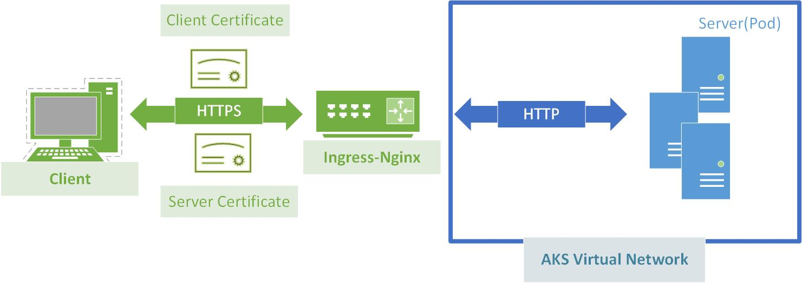
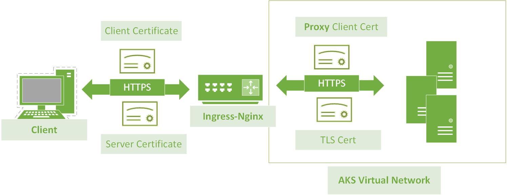

# OSM with HTTPS Ingress Controller 
* TOC
{:toc}

## Background
Now we have our [demo application](https://lissff.github.io/osm-part1/) running perfectly, and ingress controller is not complaining about anything.  
We are going to face the reality-- people using service mesh because it is   
**flexible**: different team works on different microservices and they only need to care about the interfaces exposed;  
**secure**: policies and mTLS can be enforced between services;  
Given that they might be owned by different org and communication between pairs of microservices must be authenticated and encrypted.

If you don't know what is certificate chain and how ingress-nginx TLS termination works,  you need to do some research before taking the next step. 

When talking about HTTPS Ingress Controller, most of the people are referring to this model where TLS terminates at Ingress-Nginx:

But we know sometimes that's not enough and sometimes we need to ensure end-to-end TLS(we will talk about it in another session):
.

## Create an Ingress Controller with Cert-manager
### Install Cert-manager
```
# Label the ingress-basic namespace to disable resource validation
kubectl label namespace ingress-basic cert-manager.io/disable-validation=true

helm repo add jetstack https://charts.jetstack.io

helm repo update

helm install cert-manager jetstack/cert-manager \
  --namespace ingress-basic \
  --version $CERT_MANAGER_TAG \
  --set installCRDs=true \
  --set nodeSelector."kubernetes\.io/os"=linux \
```
Create your own CA issuer:
```
apiVersion: cert-manager.io/v1
kind: ClusterIssuer
metadata:
  name: letsencrypt
spec:
  acme:
    server: https://acme-v02.api.letsencrypt.org/directory
    email: lissff@something.com
    privateKeySecretRef:
      name: letsencrypt
    solvers:
    - http01:
        ingress:
          class: nginx
          podTemplate:
            spec:
              nodeSelector:
                "kubernetes.io/os": linux
```
### Update your Ingress rules:   
- refer to letsencrypt as cluster issuer
- refer to ingress-tls to be your secretName
- refer to the right host(cert-manager will manage it)  

```
- apiVersion: networking.k8s.io/v1
  kind: Ingress
  metadata:
    annotations:
      cert-manager.io/cluster-issuer: letsencrypt
      nginx.ingress.kubernetes.io/rewrite-target: /$2
      nginx.ingress.kubernetes.io/use-regex: "true"
    name: test-ingress
    namespace: osm
  spec:
    ingressClassName: nginx
    rules:
    - host: osm-tls.canadacentral.cloudapp.azure.com
      http:
        paths:
        - backend:
            service:
              name: whoami
              port:
                number: 80
          path: /whoami(/|$)(.*)
          pathType: Prefix
        - backend:
            service:
              name: azure-vote-front
              port:
                number: 80
          path: /vote(/|$)(.*)
          pathType: Prefix
    tls:
    - hosts:
      - osm-tls.canadacentral.cloudapp.azure.com
      secretName: ingress-tls
```
### Allow Certificate Challenge in IngressBackend
After everything is done, you can verify the process by
```
$ kubectl get certificate --namespace osm
```
If your certificate is created before enabling service mesh then we are happy now. But if OSM was enabled in the first place, you will notice that the certificate is just stuck in UnReady status forever:   
```
NAME          READY   SECRET        AGE
ingress-tls   False    ingress-tls   12m
```
If you check the events for certificateRequest and it is probabaly telling you the request is not been aproved. And checking the ingress-controller log, it would tell you the challenge failed to reach your backend service:

```
 [error] 384#384: *107642 recv() failed (104: Connection reset by peer) while reading response header from upstream, client: 10.240.0.105, server: osm-tls.canadacentral.cloudapp.azure.com, request: "GET /.well-known/acme-challenge/mPtGqYkqEKmcED7cPJ0cpj4jeORD0mMNzkdLjH6_3Uc HTTP/1.1", upstream: "http://10.240.0.112:8089/.well-known/acme-challenge/mPtGqYkqEKmcED7cPJ0cpj4jeORD0mMNzkdLjH6_3Uc", host: "osm-tls.canadacentral.cloudapp.azure.com"
```

This is because cert-manager will run a one-off challenge service called cm-acme-http-solver-*** and then removes itself as long as DNS and the hostname have been configured correctly.   
For me I just added the challenge service name to my ingressbackend and issue resolved:
```
  - name: cm-acme-http-solver-p7m8j
    port:
      number: 8089
      protocol: http
```
But I don't think it is an elegant solution because the challenge is transient and you need to know the name first, you could remove it after everything is working again of course. Or you could just make certificate and everything configured before enabling OSM in your namespace.

### Verify your certificate
```
openssl s_client -connect osm-tls.canadacentral.cloudapp.azure.com -showcerts
```
You will see something like this: a beautiful 3 layer certificate chain with your host name in server CN:
```
CONNECTED(00000005)
depth=2 C = US, O = Internet Security Research Group, CN = ISRG Root X1
verify return:1
depth=1 C = US, O = Let's Encrypt, CN = R3
verify return:1
depth=0 CN = osm-tls.canadacentral.cloudapp.azure.com
verify return:1
---
...
```

what's next  
End-To-End with Nginx Ingress
gRPC in nginx ingress
understand certificate chain
